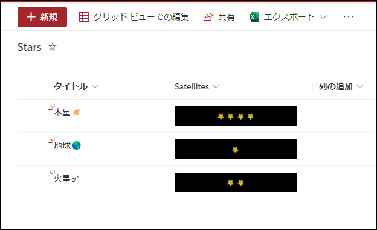

# フィールド カスタマイザーのサンプル: Twinkle stars

## Summary

SharePoint Framework Extensions のフィールド カスタママイザーを用いて数値列の数値の数だけ星の絵文字を表示します。絵文字には CSS を用いてアニメーション効果を適用します。列の書式では難しい表現もフィールドカスタマイザーなら可能です。

## Used SharePoint Framework Version

## Applies to

- [SharePoint Framework](https://aka.ms/spfx)
- [Microsoft 365 tenant](https://docs.microsoft.com/en-us/sharepoint/dev/spfx/set-up-your-developer-tenant)

> Get your own free development tenant by subscribing to [Microsoft 365 developer program](http://aka.ms/o365devprogram)

## Solution

| Solution    | Author(s)                                               |
| ----------- | ------------------------------------------------------- |
| FieldCustomizer_TwinkleStars | Ai HIRANO (@ai_yamasaki) |

## Version history

| Version | Date             | Comments        |
| ------- | ---------------- | --------------- |
| 1.0     | June 23, 2022 | Initial release |

## Disclaimer

**THIS CODE IS PROVIDED _AS IS_ WITHOUT WARRANTY OF ANY KIND, EITHER EXPRESS OR IMPLIED, INCLUDING ANY IMPLIED WARRANTIES OF FITNESS FOR A PARTICULAR PURPOSE, MERCHANTABILITY, OR NON-INFRINGEMENT.**

---

## 使い方
事前にカスタム リストを用意し、数値列を "Sattelites" という名前で作成しておきます。ここには整数の0以上を指定します。

- このレポジトリをクローンします
- 次のコマンドを実行します:
  - **npm install**

config\serve.json 内の URL を自身の環境のURLに書き換えます。

- 次のコマンドを実行します:
  - **gulp serve**

## References

- [Getting started with SharePoint Framework](https://docs.microsoft.com/en-us/sharepoint/dev/spfx/set-up-your-developer-tenant)
- [Building for Microsoft teams](https://docs.microsoft.com/en-us/sharepoint/dev/spfx/build-for-teams-overview)
- [Use Microsoft Graph in your solution](https://docs.microsoft.com/en-us/sharepoint/dev/spfx/web-parts/get-started/using-microsoft-graph-apis)
- [Publish SharePoint Framework applications to the Marketplace](https://docs.microsoft.com/en-us/sharepoint/dev/spfx/publish-to-marketplace-overview)
- [Microsoft 365 Patterns and Practices](https://aka.ms/m365pnp) - Guidance, tooling, samples and open-source controls for your Microsoft 365 development
